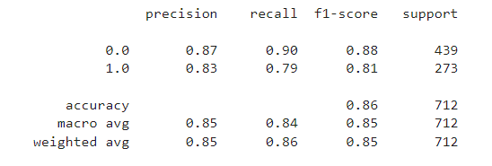

# Imbalanced Dataset

- `Imbalanced Dataset` : There is significant imbalance/difference of total/proportion (usually >75% or >80%) between classes in Classification cases
    - Example: Customer Churn 5%, not churn 95%
- Less in proportion class (<25%) = Minority Class
- Greater proportion class (>75%) = Majority Class
- **GOALS** of the Model is to find/determine _Data_ in Minority Class
    - Example: COVID-19 positive cases, Ronaldo's shot going into the net
- _Data_ used for classification is the different data from the one used to build the Model => entirely new Data
- Model from imbalanced dataset will contain **BIAS** / have tendency to predict New Data categorized as Majority Class and `struggle to predict New Data categorized as Minority Class` (**GOALS**)

- Occur in classification cases
- Usually appear in dataset used for detection (detector), but not ALWAYS
    - Detector -> Model which purpose to find certain classes
    - Class -> target/label
- Example:
    1. Hotel cancelation
    2. Employee turnover
    3. Employee promotion
    4. Customer churn
    
## CASE EXAMPLE
- Project want to predict probability of customer churn, so before the customer actually churn, we could done treatment based on the historical data
    - Total 10,000 data (9,800 loyal customers, 200 churn)
    - **GOAL** : To find probability / tendecy of customers to move to competitor or did not make transaction with us anymore

- Confusion Matrix example:
    - True-Positive : 9,800
    - True-Negative : 0 -> our **GOAL** is to find customers in this category, but we failed entirely
    - False-Positive : 0
    - False-Negative : 200

- If we calculate accuracy score of Confusion Matrix above, we would have 0.98 accuracy from the Model (`IN GENERAL, ACCURACY IS RARELY USED FOR IMBALANCED DATA`, WE FAILED TO DETERMINE CUSTOMERS WHO WERE GOING OUT)

### So when Accuracy may be used for Imbalanced Data ?
`If the value of every features in every classes are TRULY DIFFERENT` (very rare cases)
- Example 1: Model to predict whether test question is categorized as Math or Physics
    - Proportion: Math 2%, Physics 98%
    - Model will struggle to predict/find Math class (`Minority`), because characteristics between Math and Physics are similar, accuracy **COULD NOT BE USED**

- Example 2: Model to predict whether test question is categorized as Math or English 
    - Proportion: Math 2%, English 98%
    - Model will easily predict/find Math class (`Minority`), because characteristics between Math and English are astronomically different, accuracy **MAY BE USED**
    
### How can I know the characteristics between categories/classes in the target is different or similar ?
- Use Base Model & Simple Model (no feature engineering, no tuning)
- Refer to `Classification Report`, see `Recall` and `Precision` value of every classes (see sample below)
- 
- If `Recall` score and/or `Precision` score of every classes is different to each other, `there is similarity` in characteristics/value between both class -> `ACCURACY MAY NOT BE USED` -> `IMBALANCED NEED TO BE HANDLED`

### If Accuracy may not be used, so which Evaluation Matrix should I pay attention to ?
- See `Precision` and/or `Recall` score of `MINORITY CLASS`
- Choosing `Precision` or `Recall` based on risk of False-Negative or False-Positive, use `F1` if both are high risk

### Which one is Minority Class then?
- To check proportion, simply use *`.value_counts()`* to Target, crosstab/groupby/pivot will functioned the same  

### Ok Ok so what should I do when I encounter a Imbalanced Dataset ?
- Make sure to use **stratify=** parameter when splitting data using `train_test_split`
- Use plenty number of algorithms (multiple testing)
- Use base model, see `Classification Report` and determine whether classes have similarities in characteristics (as explained above)
- Use algorithms that have **Class_Weight=** parameter
    - Class_Weight: control focus of Model in training process -> proportion/degree of focus could be adjust
    - ex: `Class_Weight = {0 : 0.05 , 1 : 0.95}` -> total class weight = 1 -> model will spare 95% training time to learning pattern of Class 1
    - Class 0 = Majority, Class 1 : Minority (as our goals is predict Minority Class)
    - Class_Weight could be tuned to find best value/composition
    - Weight/Proportion for Minority class must be greater than Majority class (again, remember our **GOALS**)
- Use **RANDOM SAMPLING** :
    1. **Random Over Sampling** : Data in `Minority` will be `randomly duplicated` until the amount is equal to `Majority`
        - ex: `Ronaldo score` 10 times [Minority], `Ronaldo missed` 100 times [Majority]
        - `Ronaldo score` consist of Ronaldo scoring from free kicks, penalty kicks, tap-in, header, solo-run, long-ranged shot
        - These 6 types of way which Ronaldo scores will be `randomly duplicated` until reaching the number of Majority (`until 100`)
    2. **Random Under Sampling** : to `randomly remove` data so that `Class 1` will be equal to `Class 0`
        - rarely used since we eliminate real data from `Class 1` [Majority]
- Use **SMOTE (Synthethic Minority Over Sampling Technique)**
    - similar to Random Over Sampling, but data in `Minority Class` will be given synthethic data untul reaching amount of `Majority`

`Over Sampling and SMOTE only be used for training set (x_train and y_train)`
    
  
